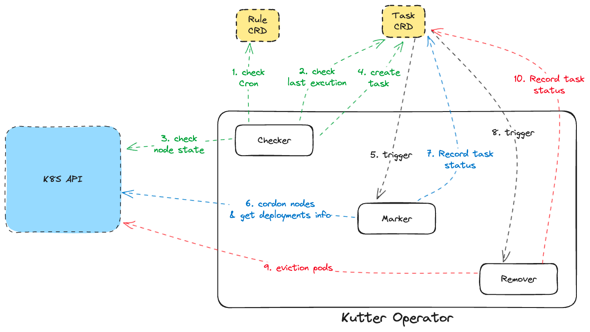

# Kutter

Cut the node in the desired state at the desired time.
This is still a proof-of-concept project.

## What is it?

It is a service that organizes nodes so that nodes can be operated efficiently at the desired time. Even in enterprise environments, you can run Kubernetes clusters cost-effectively by quickly organizing a large number of nodes and deployments.

### What's different about Kapenter consolidation feature?

Personally, I found karepnter's consolidation difficult to apply because of the following reasons.

1. you can't manage when to consolidate.

Karepnter is event-driven, so I was able to spin up nodes very quickly when provisioning, but this can be a disadvantage when consolidating nodes.

When you spin up a node, there is a strong, very simple, unquestionable event that you can rely on: the pod is unscheduled. But when it comes to cleaning up nodes, there's a lot more to consider. For example, when a large event suddenly occurs, reliability may be more important than cost-effective cleanup. 
So in kutter, we're going to let you trash nodes only when you want to. For now, we plan to implement pulling method, but in the future, we are also considering cleaning up nodes based on events that occurred at a specific time like Karpenter.

2. pod eviction does not wait for new pods to be ready.

When evicting a pod, Kubernetes thinks that the eviction is complete when the pod is scheduled on another node. It doesn't wait for the service to be ready.
PDBs are a great way to address these issues.
However, I have found that even when PDB gives MaxUnAvalialbe a value of 1
I've experienced poor availability due to application warming and other issues, so I added an option to remove the next pod after 
I added an option to evict the next pod after N seconds, even if the pod is ready. 
drain operation to have more control over it.

## Installation

We will support installation via Helm.

## Usage

WIP

## Architecture

## Contributing

Pull requests are welcome. For major changes, please open an issue first
to discuss what you would like to change.

Please make sure to update tests as appropriate.

## License

[MIT](https://choosealicense.com/licenses/mit/)